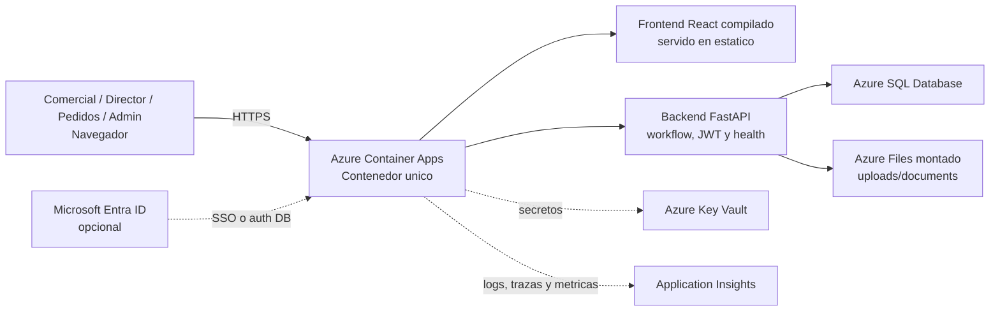

# Arquitectura Azure MVP

## Objetivo

Definir una arquitectura Azure MVP segura y mantenible para este sistema de alta de clientes, respetando como funciona hoy el repositorio: React compilado dentro del mismo contenedor, backend FastAPI, base de datos externa y almacenamiento de documentos subidos.

## Diagrama



## Flujos clave

1. El navegador consume la SPA de React servida desde el mismo contenedor.
2. La SPA invoca la API FastAPI para autenticacion, workflow y gestion de solicitudes.
3. FastAPI persiste usuarios, solicitudes y aprobaciones en Azure SQL Database.
4. Los documentos adjuntos se guardan en un volumen compartido montado sobre Azure Files, manteniendo el patron actual del repositorio.

## Seguridad

- HTTPS only en Container Apps o App Service.
- `DATABASE_URL`, `JWT_SECRET_KEY` y secretos de Entra resueltos desde Key Vault.
- CORS restringido al frontend desplegado.
- JWT fuerte y sin credenciales embebidas en codigo o scripts.
- `Microsoft Entra ID` como opcion de evolucion natural para SSO y control corporativo.

## Observabilidad

- `GET /health` comprueba proceso y conectividad real con base de datos.
- Application Insights para peticiones, errores, dependencias y analitica operativa.
- Logs de backend y contenedor centralizados por plataforma.

## Escalado y mantenibilidad

- El contenedor unico simplifica el MVP y reduce complejidad operativa.
- La base de datos ya esta externalizada en Azure SQL, por lo que el compute puede escalar horizontalmente.
- Azure Files evita perder adjuntos cuando las replicas se reinician.
- Si el producto crece, el siguiente paso mantenible es separar frontend y backend sin romper el contrato HTTP ni el modelo de datos.

## Prompt Para Gemini

```text
Genera un diagrama de arquitectura Azure profesional para el repositorio "Formulario webapp nuevo cliente".

Usa iconos oficiales y actuales de Microsoft Azure. Quiero un diagrama claro, elegante y orientado a documentacion tecnica de repositorio. No inventes servicios fuera de esta lista.

Componentes obligatorios:
- Usuarios internos con roles comercial, director, pedidos y admin
- Azure Container Apps como runtime principal
- Azure SQL Database
- Azure Files
- Azure Key Vault
- Application Insights
- Microsoft Entra ID como opcional
- Dentro de Container Apps, indicar: contenedor unico, frontend React compilado servido en estatico, backend FastAPI, workflow multi-rol, JWT, endpoint /health

Flujos a representar:
- Usuarios -> HTTPS -> Container Apps
- Frontend React servido desde el mismo contenedor
- Backend FastAPI -> Azure SQL Database
- Backend FastAPI -> Azure Files para uploads/documents
- Container Apps -> Key Vault para DATABASE_URL, JWT_SECRET_KEY y secretos de Entra
- Container Apps -> Application Insights para logs, trazas y metricas
- Entra ID -> Container Apps como SSO opcional o autenticacion corporativa futura

Mensajes cortos visuales:
- single container MVP
- secure secrets handling
- health probe with DB check
- horizontal scale with external SQL

Titulo sugerido: "Customer Onboarding - Azure MVP Architecture"
Subtitulo sugerido: "Single-container React + FastAPI with Azure SQL"
```
